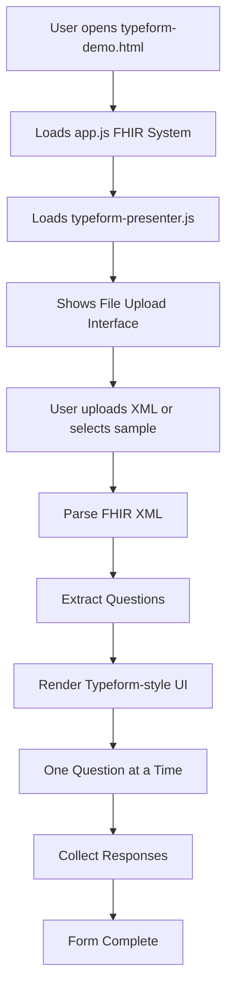

# 🏥 FHIR Questionnaire System - Complete Technical Guide

## 📚 Table of Contents

1. [System Overview](#system-overview)
2. [File Structure & Dependencies](#file-structure--dependencies)
3. [How typeform-demo.html Works](#how-typeform-demohtml-works)
4. [Architecture Deep Dive](#architecture-deep-dive)
5. [Loading Process Step-by-Step](#loading-process-step-by-step)
6. [Key Components](#key-components)
7. [Troubleshooting](#troubleshooting)
8. [Development Guide](#development-guide)

---

## 🎯 System Overview

**What is this system?**
This is a modern web-based FHIR (Fast Healthcare Interoperability Resources) questionnaire system that transforms medical XML questionnaires into interactive web forms. Think of it as "Typeform for healthcare" - it takes boring medical questionnaires and makes them user-friendly with a conversational, one-question-at-a-time interface.

**Key Technologies:**

- **Web Components** (Custom Elements) - For the core FHIR functionality
- **Shadow DOM** - For style isolation
- **TypeScript/JavaScript** - Compiled bundle (~8MB)
- **FHIR R4 Standard** - Healthcare data format
- **XML Parsing** - For questionnaire data

---

## 📁 File Structure & Dependencies

### Critical Files for typeform-demo.html Success

```
FhirQuestionnaries-03-06-2025-dev/
├── 🔥 ESSENTIAL FILES (Required for demo to work)
│   ├── typeform-demo.html          # Main demo page
│   ├── app.js                      # FHIR system (8.1MB) - CORE DEPENDENCY
│   ├── typeform-presenter.js       # Typeform-style UI (36KB)
│   └── samples/                    # Sample FHIR XML files
│       ├── RD17_cs-DE_FHIR-Questionnaire.xml
│       ├── SystA_en-GB_FHIR-Questionnaire.xml
│       └── Form-with-GDT.xml
│
├── 📊 SUPPORTING FILES
│   ├── index.d.ts                  # TypeScript definitions (100KB)
│   ├── fhir-extensions-manager.js  # Extensions support (1.9MB)
│   └── index.js                    # Alternative FHIR bundle (8.1MB)
│
└── 🛠️ OPTIONAL FILES
    ├── server.py                   # Local development server
    ├── working-demo.html           # Previous version
    └── debug-test.html             # Testing version
```

### Path Requirements

**⚠️ CRITICAL:** All these files must be in the **SAME DIRECTORY** as `typeform-demo.html`:

1. **`./app.js`** - Contains the entire FHIR system (8.1MB compiled bundle)
2. **`./typeform-presenter.js`** - The Typeform-style UI wrapper
3. **`./samples/`** - Directory with sample XML questionnaires

---

## 🔄 How typeform-demo.html Works

### The Magic Formula

```
FHIR XML + app.js + typeform-presenter.js = Interactive Typeform-style Form
```

### Visual Flow



---

## 🏗️ Architecture Deep Dive

### Layer 1: Core FHIR System (app.js)

**What it contains:**

- FHIR R4 specification implementation
- XML parsers for questionnaire files
- Web Components (`<fhir-form-widget>`, `<fhir-form>`)
- Form validation and logic
- Medical terminology support

**Size:** 8.1MB (massive because it includes entire medical vocabulary!)

### Layer 2: Typeform Presenter (typeform-presenter.js)

**What it does:**

- Wraps existing FHIR forms in modern UI
- Extracts questions from FHIR widgets
- Creates one-question-at-a-time interface
- Handles navigation and progress
- Maintains FHIR compliance

**Technology:** Custom Web Component with Shadow DOM

### Layer 3: Demo Interface (typeform-demo.html)

**Features:**

- File upload with drag & drop
- Sample questionnaire selection
- Loading states and error handling
- Responsive design

---

## ⚡ Loading Process Step-by-Step

### Phase 1: Initial Load (First 3 seconds)

```javascript
// 1. Browser loads typeform-demo.html
// 2. Loads app.js (8.1MB) - Takes 1-3 seconds
// 3. Loads typeform-presenter.js (36KB) - Quick
// 4. Registers Web Components in browser
```

### Phase 2: FHIR System Detection

```javascript
// The demo waits for these to be available:
window.customElements.get('fhir-form-widget'); // Primary check
window.customElements.get('fhir-form'); // Alternative
window.FhirForm; // Global fallback
window.mediDOK; // Another fallback
```

### Phase 3: File Processing

```javascript
// When user uploads/selects XML:
1. File content read as text
2. Passed to typeform-presenter.js
3. FHIR system parses XML into form widgets
4. Typeform extracts individual questions
5. Renders one-question-at-a-time interface
```

### Phase 4: Runtime Flow

```javascript
// During user interaction:
Original FHIR Widget (hidden) ←→ Typeform UI (visible)
         ↓                              ↓
   Stores answers                 Shows questions
         ↓                              ↓
   Validates data              Collects responses
```

---

## 🧩 Key Components

### 1. FHIRUploaderDemo Class

**Purpose:** Main orchestrator class in typeform-demo.html

**Key Methods:**

```javascript
loadFile(file); // Handles file upload
loadSampleFile(filePath); // Loads sample questionnaires
waitForFHIRSystem(); // Ensures FHIR is ready
waitForTypeformPresenter(); // Ensures UI is ready
loadQuestionnaire(xmlContent); // Coordinates the loading
```

### 2. TypeformPresenter Web Component

**Purpose:** Transforms FHIR forms into Typeform-style interface

**Key Features:**

- Shadow DOM for style isolation
- Question extraction from FHIR widgets
- Progressive navigation
- Response synchronization
- Keyboard navigation

### 3. FHIR Form Widget (from app.js)

**Purpose:** Core medical form functionality

**Capabilities:**

- Parses FHIR R4 XML
- Renders medical form controls
- Validates medical data
- Handles conditional logic
- Supports digital signatures

---

## 🔧 Troubleshooting

### Common Issues & Solutions

#### ❌ "FHIR system failed to load"

**Cause:** `app.js` didn't load or Web Components not registered

**Solutions:**

1. Check network tab - did `app.js` load (8.1MB)?
2. Wait longer - large file takes time
3. Refresh browser
4. Use local server (not file:// protocol)

#### ❌ "Failed to load sample file"

**Cause:** CORS issues or missing files

**Solutions:**

1. Run from web server (use `python server.py`)
2. Check if `samples/` directory exists
3. Verify sample files are present

#### ❌ Questions not appearing

**Cause:** XML parsing failed or questions not extracted

**Solutions:**

1. Check browser console for errors
2. Verify XML is valid FHIR R4 format
3. Try different sample files

### Debug Tools

**Browser Console Commands:**

```javascript
// Check FHIR system status
console.log('FHIR ready:', !!window.customElements.get('fhir-form-widget'));

// Check loaded globals
Object.keys(window).filter((k) => k.includes('fhir'));

// Check typeform presenter
document.querySelector('typeform-presenter').fhirSystemReady;
```

---

## 🚀 Development Guide

### Running the Demo

**Option 1: Python Server (Recommended)**

```bash
cd /Users/hanchen/Downloads/FhirQuestionnaries-03-06-2025-dev
python server.py
# Open http://localhost:8000/typeform-demo.html
```

**Option 2: Any Web Server**

```bash
# Node.js
npx http-server -p 8000

# PHP
php -S localhost:8000

# Python 3
python -m http.server 8000
```

### File Dependencies Map

```
typeform-demo.html needs:
├── app.js ────────────── Contains entire FHIR system
├── typeform-presenter.js ── Contains Typeform UI wrapper
└── samples/ ──────────── Contains sample XML files
    ├── *.xml ────────── FHIR R4 questionnaire files
```

**⚠️ Important:** Never serve with `file://` protocol - use proper web server!

### Customization Points

1. **Styling:** Modify CSS custom properties in typeform-presenter.js
2. **Branding:** Update colors in typeform-demo.html
3. **Behavior:** Extend TypeformPresenter class
4. **Validation:** Add custom validation rules

### Performance Notes

- **app.js is 8.1MB** - Consider CDN for production
- **First load is slow** - Implement loading screen
- **Caching is crucial** - Set appropriate headers
- **Mobile optimization** - Large bundle impacts mobile

---

## 🎓 Summary for IT Understanding

**Think of this system like this:**

1. **app.js** = The engine (like a car engine - complex, heavy, powerful)
2. **typeform-presenter.js** = The body/interface (like car dashboard - user-friendly wrapper)
3. **typeform-demo.html** = The complete car (combines engine + interface)
4. **FHIR XML files** = The fuel (data that powers the system)

**The magic happens when:**

- Heavy FHIR engine processes medical data correctly ✅
- Light Typeform wrapper makes it beautiful and usable ✅
- Result: Medical-grade questionnaires that feel like Typeform ✅

**Success Requirements:**

- All files in same directory ✅
- Proper web server (not file://) ✅
- Valid FHIR XML questionnaires ✅
- Modern browser with Web Components support ✅

---

_Built with ❤️ for modern healthcare interfaces_
